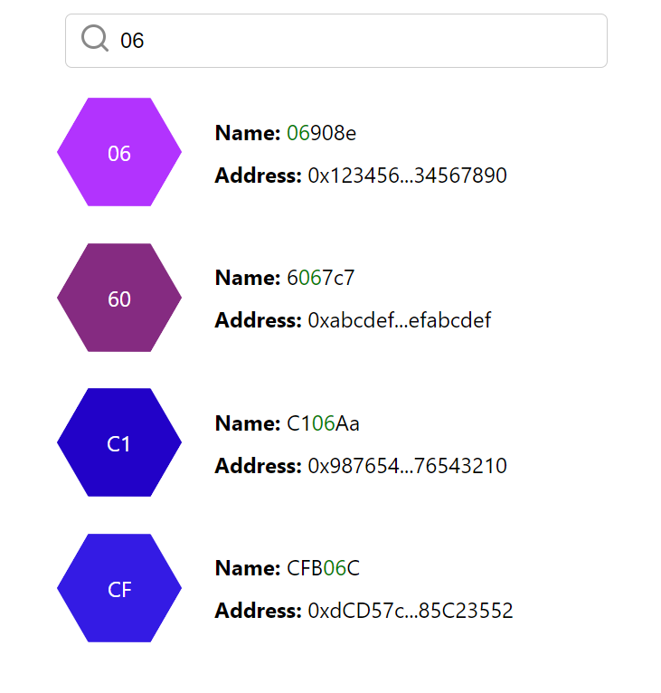

# search-case

## 问题一： 搜索组件客户端逻辑

>搜索组件客户端逻辑代码 `SearchComponent.jsx`

```jsx
/* SearchComponent.jsx */

import React, { useState, useEffect } from "react";
import "./searchComponent.css";

// 模拟后台提供数据
const search = async (keywords) => {
  const delay = Math.random() * 9000 + 1000;
  await new Promise((resolve) => setTimeout(resolve, delay));

  return [
    { name: "06908e", address: "0x1234567890123456789012345678901234567890" },
    { name: "6067c7", address: "0xabcdefabcdefabcdefabcdefabcdefabcdefabcdef" },
    { name: "C106Aa", address: "0x9876543210987654321098765432109876543210" },
    { name: "CFB06C", address: "0xdCD57c947C4BFe00B84fECFFd4d4956f85C23552" },
  ];
};

// 高亮匹配的文本
const highlightText = (text, keywords) => {
  if (!keywords) return text;
  const parts = text.split(new RegExp(`(${keywords})`, "gi"));
  return parts.map((part, index) =>
    part.toLowerCase() === keywords.toLowerCase() ? (
      <span key={index} className="highlighted-text">
        {part}
      </span>
    ) : (
      part
    )
  );
};

// 格式化地址，只显示前8位和后8位，中间用省略号表示
const formatAddress = (address) => {
  return (
    address.substring(0, 8) + "..." + address.substring(address.length - 8)
  );
};

// 生成随机的颜色值
const randomColor = () => {
  return "#" + Math.floor(Math.random() * 16777215).toString(16);
};

// 展示搜索结果组件
const SearchResult = ({ results, keywords }) => {
  return (
    <ul className="search-results">
      {results.map((result) => (
        <li className="search-item" key={result.address}>
          <div className="hexagon" style={{ backgroundColor: randomColor() }}>
            <span>{result.name.slice(0, 2)}</span>
          </div>
          <div>
            <div className="result-item">
              <strong>Name:</strong> {highlightText(result.name, keywords)}
            </div>
            <div className="result-item">
              <strong>Address:</strong> {formatAddress(result.address)}
            </div>
          </div>
        </li>
      ))}
    </ul>
  );
};

// 搜索组件
const SearchComponent = () => {
  const [searchResults, setSearchResults] = useState([]);
  const [keywords, setKeywords] = useState("");
  const [searching, setSearching] = useState(false);

  // 防抖
  useEffect(() => {
    const delaySearch = setTimeout(() => {
      if (keywords) {
        handleSearch(keywords);
      } else {
        setSearchResults([]);
        setSearching(false);
      }
    }, 500);

    return () => clearTimeout(delaySearch);
  }, [keywords]);

  const handleSearch = async (keywords) => {
    setSearching(true);
    const results = await search(keywords);
    setSearchResults(results);
    setSearching(false);
  };

  return (
    <div className="search-container">
      <div className="search-input-wrapper">
        <div className="search-icon">
          <svg
            xmlns="http://www.w3.org/2000/svg"
            width="24"
            height="24"
            viewBox="0 0 24 24"
            fill="none"
            stroke="currentColor"
            strokeWidth="2"
            strokeLinecap="round"
            strokeLinejoin="round"
          >
            <circle cx="11" cy="11" r="8"></circle>
            <line x1="21" y1="21" x2="16.65" y2="16.65"></line>
          </svg>
        </div>
        <input
          className="search-input"
          type="text"
          placeholder="Search..."
          value={keywords}
          onChange={(e) => setKeywords(e.target.value)}
        />
      </div>
      {searching ? (
        <div className="search-status">Searching...</div>
      ) : (
        <SearchResult results={searchResults} keywords={keywords} />
      )}
    </div>
  );
};

export default SearchComponent;
```

>客户端css代码 `searchComponent.css`

```css
/* searchComponent.css */

.search-container {
  max-width: 400px;
  margin: 0 auto;
  padding: 20px;
}

.search-input-wrapper {
  position: relative;
  display: flex;
  align-items: center;
}

.search-icon {
  position: absolute;
  left: 10px;
  font-size: 18px;
  color: #888;
}

.search-input {
  width: calc(100% - 30px);
  padding: 10px;
  padding-left: 40px;
  font-size: 16px;
  border: 1px solid #ccc;
  border-radius: 5px;
  outline: none;
}

.search-results {
  list-style: none;
  padding: 0;
}

.search-item {
  margin-bottom: 15px;
  display: flex;
  align-items: center;
}

.result-item + .result-item {
  margin-top: 10px;
}

.result-item strong {
  font-weight: bold;
}

.highlighted-text {
  color: green;
}

.search-status {
  margin-top: 10px;
  font-style: italic;
  color: #888;
}

.hexagon {
  margin-right: 30px;
  width: 80px;
  height: 92px;
  background-color: #6c5ce7;
  position: relative;
  clip-path: polygon(50% 0, 100% 25%, 100% 75%, 50% 100%, 0 75%, 0 25%);
  transform: rotate(30deg);
  display: flex;
  align-items: center;
  justify-content: center;
  font-size: 16px;
  color: #fff;
}

.hexagon span {
  transform: rotate(-30deg);
}

.hexagon::before,
.hexagon::after {
  content: "";
  position: absolute;
  width: 0;
  border-left: 40px solid transparent;
  border-right: 40px solid transparent;
}

.hexagon::before {
  bottom: 100%;
  border-bottom: 23px solid #6c5ce7;
}

.hexagon::after {
  top: 100%;
  border-top: 23px solid #6c5ce7;
}

```

>执行结果




## 问题二:  可能需要的搜索逻辑测试

1. **输入验证测试：**
   - 测试空输入是否会触发搜索请求。
   - 测试输入是否被正确验证，例如限制长度、禁止特殊字符等。
2. **防抖功能测试：**
   - 测试连续输入两个不同的关键词，确保第一个搜索请求被取消，并且只有最后一个搜索请求被执行。
   - 测试输入之间的时间间隔，以确保在防抖时间内多次输入只触发一次搜索请求。
3. **搜索结果显示测试：**
   - 测试搜索结果是否正确显示在界面上。
   - 测试搜索结果是否根据关键字匹配正确高亮显示。
   - 测试搜索结果为空时是否正确显示空结果提示信息。
4. **错误处理测试：**
   - 测试搜索过程中的网络错误或后端异常情况下的处理是否正确。
   - 测试非法输入时是否给出适当的错误提示。
5. **搜索结果缓存测试：**
   - 测试相同的搜索关键字是否会从缓存中获取结果，而不是重新发送网络请求。
6. **移动端优化测试：**
   - 在移动设备上测试搜索组件的可用性和可视化效果。
   - 测试触摸操作是否与预期一致。
7. **键盘操作支持测试：**
   - 测试使用键盘进行搜索时的快捷键是否有效。
   - 测试使用键盘浏览搜索结果时的导航是否正确。
8. **性能测试：**
   - 测试搜索功能的响应时间和渲染性能。
   - 测试大量搜索结果时的页面加载性能。
9. **国际化和本地化测试：**
   - 测试不同语言和地区设置下的搜索功能是否正常工作。
10. **用户体验测试：**
    - 进行用户体验测试，收集用户反馈，检查搜索功能是否符合用户期望。
11. **搜索结果排序测试：**
    - 测试搜索结果是否按照预期的排序方式呈现，例如按名称字母顺序、按地址等排序。
12. **搜索结果分页测试：**
    - 测试搜索结果是否正确分页，确保分页功能正常工作，并且可以正确地切换和显示不同页的结果。
13. **搜索建议/自动补全测试：**
    - 测试搜索框输入时是否正确显示搜索建议或自动补全列表，并验证点击建议时是否能正确执行搜索。
14. **快速输入测试：**
    - 测试快速输入时是否能够正确处理连续输入的情况，并验证是否会正确地显示最新的搜索结果。
15. **多种输入设备测试：**
    - 测试在不同的输入设备上（例如鼠标、键盘、触摸屏）是否能够正常触发搜索，并检查用户交互是否符合预期。
16. **浏览器兼容性测试：**
    - 测试在不同的浏览器中（例如Chrome、Firefox、Safari、Edge等）是否能够正常使用搜索功能，并检查界面是否在不同浏览器下呈现一致。
17. **响应式设计测试：**
    - 测试在不同屏幕尺寸和设备方向下，搜索组件是否能够正确地适应并呈现，确保响应式设计的有效性。
18. **安全性测试：**
    - 测试搜索功能是否存在安全漏洞，例如XSS攻击、SQL注入等。
19. **用户权限测试：**
    - 如果搜索功能受用户权限控制，测试不同权限用户对搜索功能的访问权限是否被正确限制。
20. **断网/离线状态测试：**
    - 测试在断网或离线状态下是否有适当的处理和提示，例如是否正确显示离线状态下的缓存结果或提示用户检查网络连接。


通过执行这些更加完整的测试用例，可以确保搜索功能在各种情况下都能正常工作，并提供出色的用户体验，同时确保其安全性和稳定性

